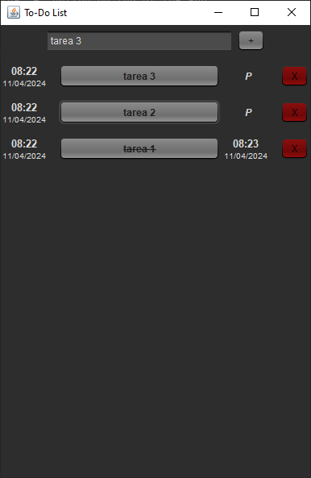

# ToDo-List

## About

A simple program to write down tasks, each task can have a series of steps
and each of them must be completed in order for the task to be completed.
Tasks and steps can be added with the "+" button on top of the app.
Each task and step have and display their creation date, 
name, completion date (or "P" if pending), and a button for deletion.
Completed tasks or steps are crossed out.

This project was made for educational purposes.